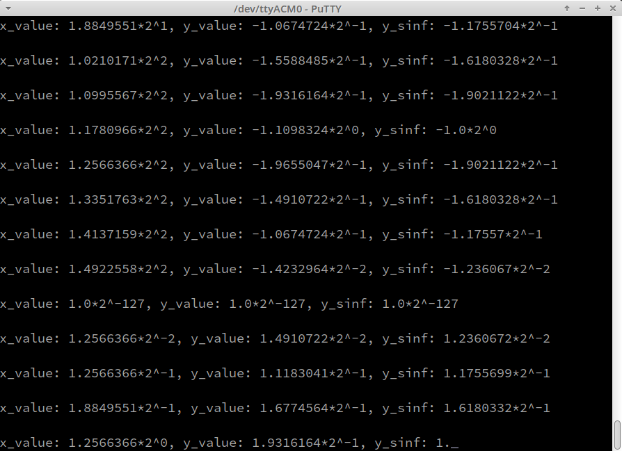

# PSoC&trade; 6 MCU: TinyML Hello World Example

This example is designed to demonstrate the absolute basics of using [TensorFlow
Lite for Microcontrollers](https://www.tensorflow.org/lite/microcontrollers).
It includes the full end-to-end workflow of training a model, converting it for
use with TensorFlow Lite for Microcontrollers for running inference on a
microcontroller.

## Train the model
This example shows how to train a 2.5 kB model to generate a sine wave (https://colab.research.google.com/github/tensorflow/tflite-micro/blob/main/tensorflow/lite/micro/examples/hello_world/train/train_hello_world_model.ipynb)

## Run the tests on a development machine

- The folder tflm-cmsis was generated following the steps at https://github.com/tensorflow/tflite-micro/blob/main/tensorflow/lite/micro/docs/new_platform_support.md#step-5-integrating-optimized-kernel-implementations
  ```
  $ python3 tensorflow/lite/micro/tools/project_generation/create_tflm_tree.py --makefile_options="TARGET=cortex_m_generic OPTIMIZED_KERNEL_DIR=cmsis_nn TARGET_ARCH=project_generation" --rename_cc_to_cpp /tmp/tflm-cmsis
  ```
- Example code from https://github.com/tensorflow/tflite-micro/tree/main/tensorflow/lite/micro/examples/hello_world

## Software Setup

Install a terminal emulator if you don't have one. Instructions in this document use [Tera Term](https://ttssh2.osdn.jp/index.html.en).

## Using the Code Example

1. Download and unzip this repository onto your local machine, or clone the repository.

2. Open a CLI terminal and navigate to the application folder.

   On Linux and macOS, you can use any terminal application. On Windows, open the **modus-shell** app from the Start menu.

   **Note:** The cloned application contains a default BSP file (*TARGET_xxx.mtb*) in the *deps* folder. Use the [Library Manager](https://www.cypress.com/ModusToolboxLibraryManager) (`make modlibs` command) to select and download a different BSP file, if required. If the selected kit does not have the required resources or is not [supported](#supported-kits-make-variable-target), the application may not work.

3. Import the required libraries by executing the `make getlibs` command.

Various CLI tools include a `-h` option that prints help information to the terminal screen about that tool. For more details, see the [ModusToolbox User Guide](https://www.cypress.com/ModusToolboxUserGuide) (locally available at *{ModusToolbox install directory}/docs_{version}/mtb_user_guide.pdf*).

## Operation

1. Connect the board to your PC using the provided USB cable through the KitProg3 USB connector.

2. Open a terminal program and select the KitProg3 COM port. Set the serial port parameters to 8N1 and 115200 baud.

3. Program the board using one of the following:

   From the terminal, execute the `make program` command to build and program the application using the default toolchain to the default target. You can specify a target and toolchain manually:
   ```
   make program TARGET=<BSP> TOOLCHAIN=<toolchain>
   ```

   Example:
   ```
   make program TARGET=CY8CPROTO-062-4343W TOOLCHAIN=GCC_ARM
   ```
</details>

4. After programming, the application starts automatically. Confirm that output from the model execution is displayed on the UART terminal.

   **Figure 1. Terminal output on program startup**

   


## Design and Implementation

### Resources and Settings

**Table 1. Application Resources**

| Resource  |  Alias/Object     |    Purpose     |
| :------- | :------------    | :------------ |
| UART (HAL) |cy_retarget_io_uart_obj| UART HAL object used by Retarget-IO for Debug UART port |

The application uses a UART resource from the [Hardware Abstraction Layer](https://github.com/cypresssemiconductorco/psoc6hal) (HAL) to print messages in a UART terminal emulator. The UART resource initialization and retargeting of standard I/O to the UART port is done using the [retarget-io](https://github.com/cypresssemiconductorco/retarget-io) library. After using `cy_retarget_io_init`, messages can be printed on the terminal by simply using `printf` commands.


## Document history

| Version | Description of change |
| ------- | --------------------- |
| 1.0.0   | Initial version       |
